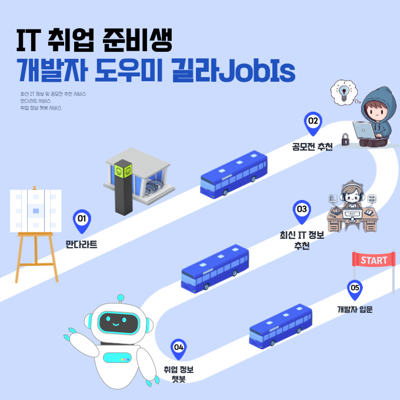
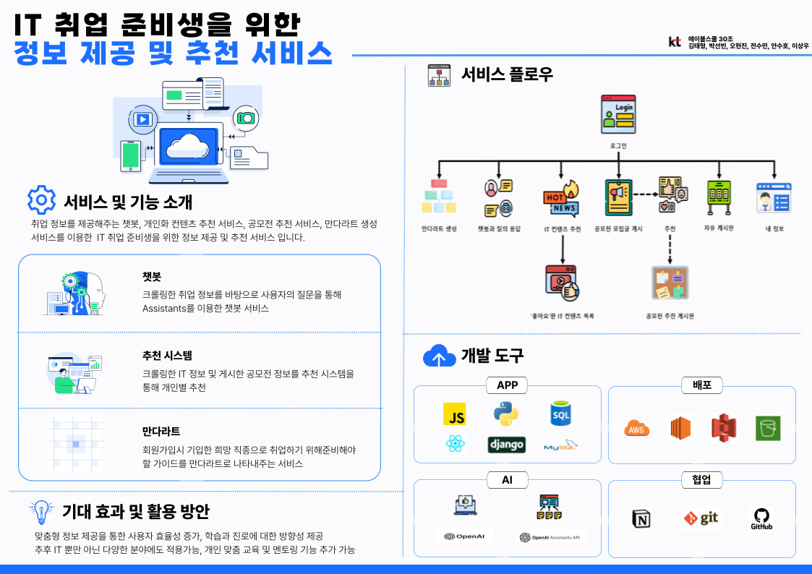
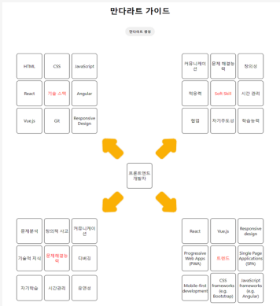
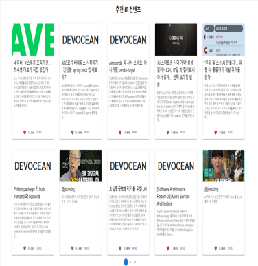
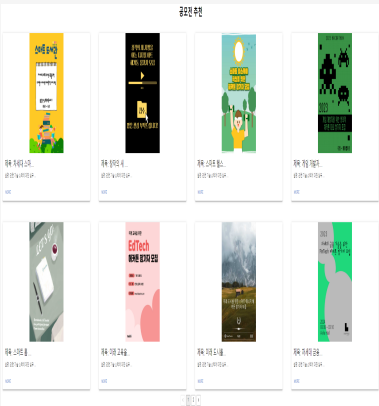
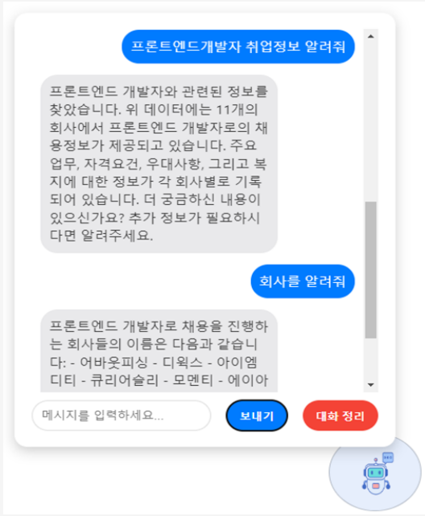

# 📊 길라 JObIS

IT 취업 준비생을 위한 정보 제공 및 추천 서비스 🖥

 

##  담당 역할 및 기여사항

-  담당역할 - Front-End
   
### 로그인/로그아웃 기능
- React의 `useContext`를 활용하여 상태 관리
- 사용자 데이터베이스를 Django로 구축하고 REST API를 통해 통신 (`axios` 사용)
- 로그인 성공 시 사용자 아이디를 `document.cookie`에 저장

### React – Django 연동
- Django REST Framework를 활용한 백엔드 구축
- `axios`를 사용하여 REST API 요청
- CORS 설정으로 다른 도메인 간의 통신 가능하도록 함
- `axios`를 활용하여 좋아요 기능 구현 및 데이터베이스 연동
- 리스트 컴포넌트에 `axios`를 활용하여 REST API로 선택 리스트 호출

### 만다라트 기능
- 쿠키를 활용하여 회원이 원하는 직종을 찾음
- 추천 항목이 생성되는 동안 진행 여부를 알려주는 UI 구성
- 값의 유무에 따라 UI 변화를 적용하여 Table 랜더링 생성
- `axios`를 통한 통신 및 Rest API 활용
- OpenAI prompt - engineering을 활용한 데이터 생성

### Chatbot 기능
- 팝업 컴포넌트를 활용하여 사용자와의 대화 상호작용
- 답변 생성 중에 대화 진행 여부를 알려주는 UI 구성
- 스레드를 활용하여 대화 내용을 기억하고 처리
- OpenAI Assistant API를 활용하여 대화 기능 구현

## 구현 과정

- 각 기능에 대한 구현은 해당 기술 스택과 API를 활용하여 개발되었습니다.
- React 및 Django 간의 연동은 `axios`를 사용하여 데이터 통신을 구현하고, CORS 설정으로 서로 다른 도메인 간 통신을 가능하게 하였습니다.
- 만다라트 및 Chatbot 기능은 사용자 상호작용에 따라 UI가 동적으로 변하도록 구현되었으며, OpenAI를 활용하여 자연스러운 대화를 제공하였습니다.
 

## 👀 프로젝트 개요

-  📆 프로젝트 기간
   -  2023.12.11 ~ 2024.01.12 (6 week)

-  📌 기획 배경

   -  취업 준비생들의 IT 직문 선호도 증가  
   -  취업 준비생의 87.1%, 취업 정보가 부족하다고 느낌 
   -  많은 취업 플랫폼이 존재, but 개인화된 정보제공 서비스는 없음 

-  👓 메인 타겟

   -  IT 분야에 취업을 하려고 관심을 가지는, 취준생 
   -  IT 관련 정보 ( 블로그글, 뉴스기사, 유튜브, 공모전 모집글 등 )를 얻고 싶은, (예비) 개발자

-  💍 핵심 가치

   -  **개인화된 정보 제공**
      -  IT 취업 시장의 복잡성과 빠른 변화를 고려하여, 개인화된 정보제공이 중요 ➡️ 사용자의 선호와 요구에 맞춘 맞춤형 정보 제공
   -  **종합적인 취업 지원**
      -  IT 취업 준비생들에게 필요한 모든 정보를 제공 ➡️ 취업 정보, 회사 정보, 직무 관련 정보 등을 포괄적으로 제공

- 🗄 산출물
  - [🔖 발표 자료](docs/발표자료.pdf) : 기획 배경부터 서비스 소개까지
  - [📽 시연 영상 (10:18)](https://www.youtube.com/watch?v=nMRzqA98iVI)

-  🥇 성과

   -  Collaboration상 수상
   -  우수 프로젝트 선정

  

## 💁‍♂️ 프로젝트 소개

 

**길라JobIs** 는 IT직군으로 취업을 희망하는 취준생들을 위한 길라잡이 역할을 한다는 의미를 담고있는 `취업 도우미 서비스` 입니다.
  
IT 기술의  빠른 발전과 기술의 성장과 함께 급속도로 성장하고 있습니다. 
이에 따라 IT 직종의 종류도 다양해지고 다양한 분야에서 IT 기술이 활용되면서 비전공자들도 IT 취업시장에 뛰어들고 있는 추세입니다. 그러나 IT 취업 준비생들이 관련 직무 정보나 취업 준비에서 정보의 접근성이 어렵다는 부분을 느꼈습니다. 이에 따라 사용자 맞춤형 정보 제공 및 추천 서비스를 기획하였습니다. 각각 개인화된 정보 제공을 통해 취업 준비생들이 효율적으로 정보를 탐색하고 활용할 수 있도록 돕고, 공모전 등 네트워킹 기회 및 경력 개발 지원을 제공하여, IT 취업 시장에서 필요한 정보 접근의 기회를 마련하고자 합니다

 

## 💡 주요 기능

### 1️⃣ 만다라트 생성 기능

> 서비스 내용 
> - 회원가입시 사용자가 선택한 희망 직종을 기반으로 직군별 해당 직무의 필요 능력(기술 스택, 문제해결 능력, Soft Skill, 트렌드)들의 키워드 8가지 가이드라인을 만다라트를 통해 보여드립니다.

> 사용 기술
> - OpenAI의 프롬프트 엔지니어링을 이용하여 만다라트 가이드 자동 생성합니다.
 

### 2️⃣ IT콘텐츠 추천 기능

> 서비스 내용
> - IT 관련 트렌드(기술 블로그, 기사, 유튜브 등)에 대해 다른 사용자가 ‘좋아요’를 표시했던 게시물을 기반으로 사용자와 관련된 IT 콘텐츠를 추천해 줍니다.

> 사용 기술 
> -	협업 필터링 : surprise 라이브러리의 SVD 알고리즘을 사용하여 사용자와 크롤링한 데이터 간의 ‘좋아요’ 상호작용을 기반으로 선호도를 추정하여 협업 필터링 점수를 계산합니다.
> -	콘텐츠 기반 필터링 :  크롤링한 데이터에 ‘좋아요’를 누른 사람들의 직업 정보를 기반으로 유사도를 계산하여 콘텐츠 기반 필터를 점수를 계산합니다.
> -	각 아이템에 대해 두 점수를 합산하여 최종 추천 점수를 계산한 후 사용자에게 추천합니다.

 

### 3️⃣ 공모전 추천 기능

> 서비스 내용
> - 회원가입 시 정보(희망 직무, 기술 스택, 선호 근무 환경 등)와 공모전 정보 (모집 분야, 요구 기술 스택, 근무 환경)을 비교한 후 콘텐츠 기반 추천 시스템을 적용하여 개인화된 공모전 추천해 줍니다.

> 사용 기술 
> -	자카이드 유사도 : 희망 직무 - 모집 분야, 선호 근무 환경 - 근무 환경의 경우 두 집합 간의 유사도를 계산합니다.
> -	코사인 유사도 : 기술 스택 - 요구 기술 스택 텍스트를 벡터화를 진행한 후 기술 스택 간 코사인 유사도를 계산합니다.
> -	종합 점수 평가 : 앞서 계산한 두 유사도 평가를 합산하여 종합 점수 산출 후 사용자에게 공모전 추천합니다.

 

### 4️⃣ 취업 정보 제공 Chatbot 기능

> 서비스 내용
> - 챗봇을 통해 사용자에게 채용 정보(회사 이름, 자격요건, 우대사항, 복지)에 대한 정보를 제공해 줍니다. 

> 사용 기술 
> -	웹 크롤링을 통해 다양한 IT 기업 취업 정보 수집합니다.
> -	OpenAI의 Assitants를 이용한 챗봇 서비스 제공합니다.

 

## 🗂 서비스 아키텍쳐 
- 👨‍🎨 **Front-End**
  - Language
    - 
  - Framework / Library
    - 

  - Design
    -   

- 🧑‍💻 **Back-End**
  - Language
    - 
  - Server
    - 
  - Data
    - 
  - open API
    - 

  - Delivery
    - 

- 👨‍👩‍👦 **Common**
  - Co-work
    -   

---
